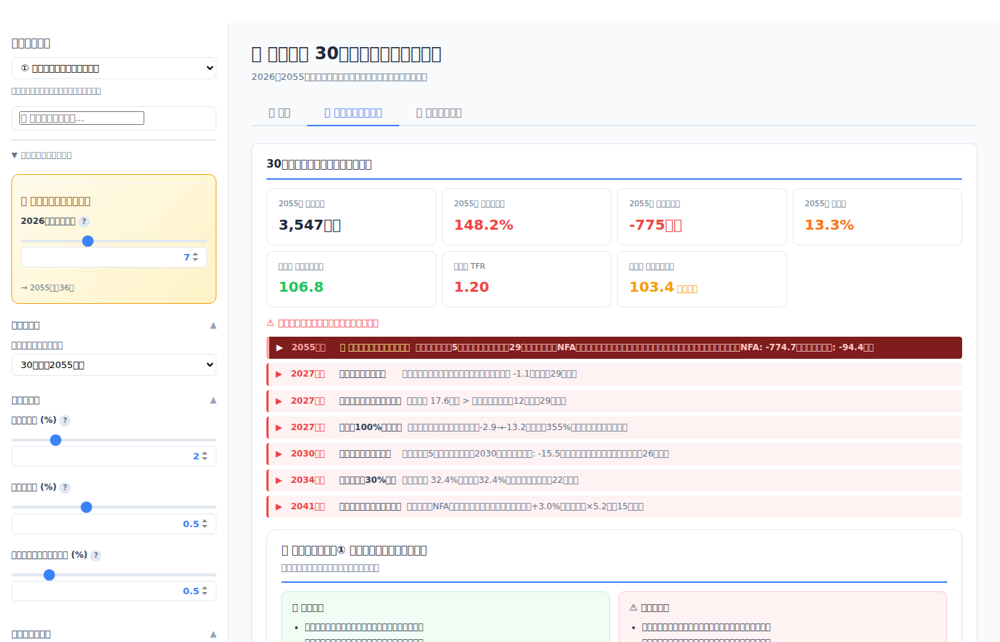
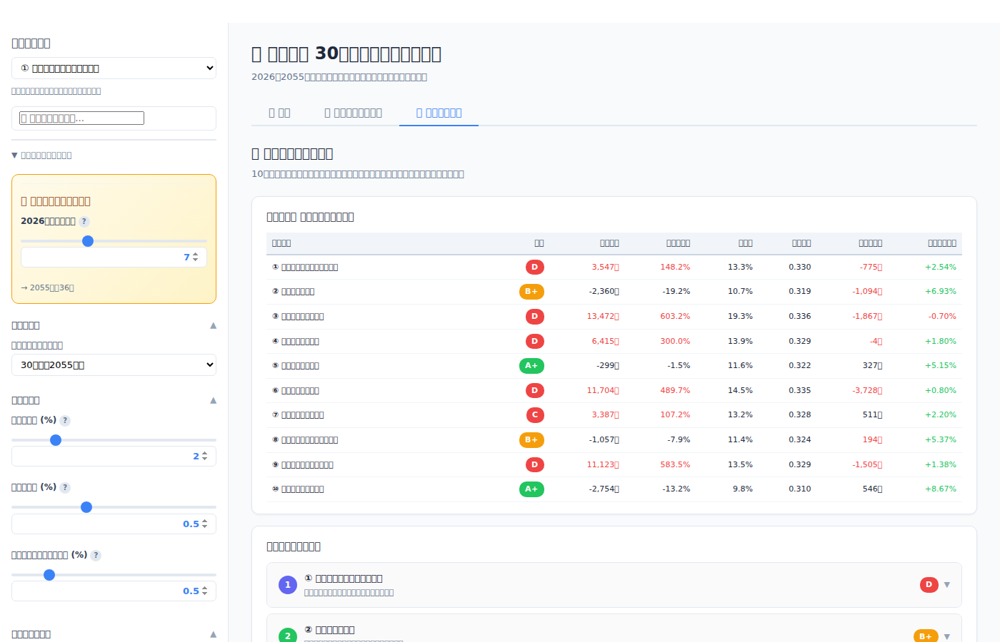
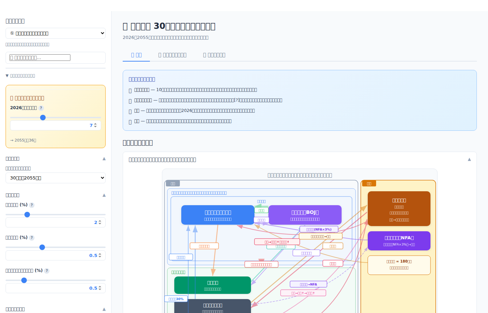

# 生成AIで「統合政府 財政シミュレーター」を作ってみた——50年後の日本の財政を可視化する

「日本の財政って、30年後どうなっているんだろう」——漠然とした不安を数字にしてみたくて、生成AI（Claude）と一緒に財政シミュレーターを作ってみた。税収・歳出・日銀バランスシート・為替レート・貧困率・出生率まで連動する統合モデルだ。プロンプトで「統合政府の概念で、政府と日銀を一体としたシミュレーターを作って」と指示するところから始めて、React + TypeScriptのWebアプリとして完成した。正直に言うと、私はマクロ経済学の専門家ではない。だからこそ、このツールを公開して専門家の方々にレビューしていただきたい。この記事では、開発の過程と実際のシミュレーション結果を紹介しつつ、今の国会議論を数字で検証してみる。

---

## なぜ「統合政府」なのか

2025年、国会では防衛費の増額、少子化対策の財源、社会保障費の抑制が同時に議論されている。「政府の借金は1,200兆円を超えた」と言われるが、日銀が国債の約半分を保有している現状で、政府と日銀を別々に見ることにどれだけ意味があるのか。統合政府——つまり政府と中央銀行を一体と見なすアプローチ——で財政を俯瞰すれば、より実態に近い姿が見えてくるはずだ。

しかし、税収・国債費・日銀損益・為替・家計への影響・人口動態が相互に影響しあう複雑なモデルを、ゼロから構築するのは容易ではない。そこで頼ったのが生成AIだった。

---

## 開発の過程——6つのフェーズとプロンプト例

開発環境にはReplitを使用し、生成AIとの対話だけでアプリを構築していった。全体で約8,300行、34ファイルのコードベースが2週間ほどで完成した。以下、開発フェーズごとにプロンプト例とその成果を紹介する。

### Phase 1：基礎構築（2/12）

最初のプロンプトは素朴なものだった。

> **プロンプト例：**
> 「日本の統合政府の財政シミュレーションツールを作って。税収（消費税・所得税・法人税・その他）と歳出（社会保障・公共事業・防衛費等）を入力して、30年間の債務残高推移をグラフで見たい。シナリオ選択機能もほしい」

この一言から、Streamlit + Pythonベースの初期プロトタイプが生成された。税収4区分、歳出の基本モデル、シナリオ選択機能が数分で動き始めた。

**主なコミット:**
- `7d55f46` Create a fiscal simulation tool for Japan's government
- `79980ff` Add scenario selection and waterfall charts to fiscal simulator

### Phase 2：機能拡張（2/21〜22）

基本モデルでは物足りない。日銀の役割を反映しなければ「統合政府」にならない。

> **プロンプト例：**
> 「日銀の保有国債の利回りと当座預金金利から日銀の純利益を計算して、統合政府への納付金として反映して。累積損失が出た場合は歳入に影響するようにして。あと貿易収支と為替の影響、家計への影響（貧困率・ジニ係数）もモデルに入れてほしい」

日銀バランスシート、QT（量的引き締め）メカニズム、貿易収支、家計インパクトモデルが追加された。10のプリセットシナリオもこの段階で設計した。

**主なコミット:**
- `cda1eba` Add Bank of Japan payment data to the fiscal simulation
- `fda8831` Add trade balance and household impact simulations

### Phase 3：UI/UX改善とReact移行（2/22〜23）

Streamlitでは表現力に限界がある。インタラクティブなチャートと滑らかなUIを求めてReact + Viteに移行した。

> **プロンプト例：**
> 「Streamlit + Plotlyから React + TypeScript + Vite + Recharts に移行して。サイドバーでパラメータをスライダーで調整できるようにして、チャートに[?]ヘルプアイコンをつけて各指標の意味を説明して。あと勾配降下法で警告数を最小化するパラメータ最適化機能もつけて」

React移行により、60以上のパラメータをリアルタイムに操作しながらチャートが即座に更新されるUIが実現した。

**主なコミット:**
- `b7684e4` Update application to use React and Vite for improved performance
- `d598484` Add chart tooltips and improve sidebar search functionality
- `693fa04` Improve performance by optimizing warning calculations

### Phase 4：高度化——内生為替と人口動態（2/26〜27）

モデルの精緻化として、為替レートと人口動態を内生化した。

> **プロンプト例：**
> 「為替レートを外生パラメータではなく、金利差（α=0.5）・インフレ差（β=0.3）・リスクプレミアム（γ=0.5）の3要因で内生的に決定するモデルにして。あと人的資本モデル（教育投資→15年ラグで生産性に反映）と内生的出生率（賃金効果・格差効果・子育て支援効果の3チャネル、TFRが20年ラグで人口成長率にフィードバック）も組み込んで」

このフェーズで、円安→輸入物価上昇→家計圧迫→貧困率上昇、教育投資→人的資本→生産性→税収、出生率→労働力→社会保障費といった複雑なフィードバックループが完成した。

**主なコミット:**
- `0dc5639` Update simulation to use endogenous exchange rate model and add historical data
- `ad9f485` Update simulation tool to incorporate human capital and demographic dynamics

### Phase 5：リファクタリング（2/27〜28）

最後に、保守性向上のためのコード整理を行った。

> **プロンプト例：**
> 「全体をリファクタリングして。型定義をtypes.tsに集約、定数をconstants.tsに分離、シナリオ定義をscenarios.tsに分離、1700行のCSSを6ファイルに分割、コンポーネントをsrc/components/に分離して。ビルドサイズは変えないで」

ビルドサイズを維持したまま（JS: 835kB, CSS: 23kB）、整理されたコードベースが完成した。

**主なコミット:**
- `1d25eae` Improve code organization by splitting components and adding comments
- `8280219` Organize and comment code for simulation tool

### Phase 6：コード品質改善とURL共有（3/1）

別のAIによるコードレビューの提案を取り込み、さらなるリファクタリングを実施した。

> **プロンプト例：**
> 「別AIの提案を元にリファクタリングして。Sidebarの巨大コンポーネントを分割（ui/Slider, NumberInput, SidebarSection + sidebar/SidebarMiniChart, ConstraintRow）、最適化ロジックをuseOptimizerフックに分離、simulation.tsのループ内係数に経済的根拠・出典コメントを補強、パラメータのURL共有機能を追加して」

Sidebar.tsxが643行から約500行に縮小（5つのUIコンポーネント＋1カスタムフックに分離）。simulation.tsの約20箇所のハードコード係数に学術的出典コメントを追加。URL共有機能により、パラメータ設定を短縮URLで他者と共有可能になった。

---

## シミュレーション結果で見る「日本の選択肢」

完成したシミュレーターで、3つのシナリオを比較してみよう。

### ① 現状維持（ベースライン）——評価：D

現在の政策をそのまま30年継続すると：

| 指標 | 30年後（2056年）の値 |
|------|-----------|
| 債務残高 | **3,547兆円** |
| 利払負担率 | **148.2%** |
| 貧困率 | 13.3% |
| 出生率（TFR） | 1.20 |

利払負担率が税収を大きく超え、財政は破綻水準に達する。警告数は25件超でD評価だ。「何もしない」ことのコストが可視化される。

### ⑩ 再分配強化——評価：A+

消費税は10%に据え置き、所得税・法人税の累進を強化し、企業の内部留保を賃金に還元するシナリオ：

| 指標 | 30年後（2056年）の値 |
|------|-----------|
| 債務残高 | **-2,754兆円**（実質無借金） |
| 利払負担率 | **-13.2%**（利子収入が上回る） |
| 貧困率 | **9.8%** |
| TFR | 1.27 |

消費税を上げずに財政健全化が達成され、貧困率も改善。警告ゼロのA+評価となる。

### ⑧ テクノロジー革命——評価：B+

AI・自動化が生産性を飛躍的に向上させるシナリオ：

| 指標 | 30年後（2056年）の値 |
|------|-----------|
| 債務残高 | **-1,057兆円** |
| 人的資本指数 | **145.3** |
| 利払負担率 | -7.9% |
| TFR | 1.19 |

テクノロジー投資と教育投資の組み合わせで人的資本指数が大幅に向上し、財政も改善する。ただし格差拡大のリスクがあり、B+評価にとどまる。

---

## 主な機能

- **60以上のパラメータ**をサイドバーのスライダーで自由に調整。検索ボックスで素早くアクセス可能
- **10のプリセットシナリオ**を棒グラフ・レーダーチャート・折れ線推移で横断比較
- **[?] チャートヘルプ**で各指標の意味と計算ロジックを確認
- **勾配降下法による最適化**で、制約条件を満たすパラメータを自動探索
- **シミュレーション期間**は30年/40年/50年から選択可能
- **解説タブ**でロジックツリーA〜J、統合政府のフロー図、データ出典を確認
- **URL共有機能**でパラメータ設定を他者と共有。デフォルト値との差分のみを短縮URLに含める

---

## 「作れること」と「正しいこと」は別——専門家の皆様へ

生成AIとの対話だけで、税収モデル・日銀損益・内生為替・人口動態フィードバック・パラメータ最適化まで含む統合シミュレーターが構築できた。プロンプトで「こういうモデルにしたい」と伝えれば、AIが経済学的な根拠を持つ実装を提案してくれる。

しかし、このシミュレーターはあくまで「たたき台」だ。以下の点について専門家のレビューが不可欠だと考えている：

1. **モデルの構造的妥当性**：フィードバックループの方向性と強度は適切か
2. **パラメータの初期値**：弾力性係数（α, β, γ等）や感応度パラメータは現実的か
3. **省略されたメカニズム**：金融市場のダイナミクス、国際資本移動、期待形成など
4. **シナリオの前提条件**：各シナリオの設定は政策議論として妥当か

「ここが違う」「この前提はおかしい」というフィードバックをいただければ、モデルを改善して再公開したい。財政の議論をデータとシミュレーションで行うための道具として、このツールが少しでも役に立てば幸いだ。

---

**ツールURL:** [統合政府 財政シミュレーター](https://unified-government-fiscal-simulator.replit.app/)

**技術スタック:** React 19 / TypeScript / Vite / Recharts / Replit

**開発期間:** 約3週間（2026年2月12日〜3月1日）

**コード規模:** 約8,300行 / 34ファイル
